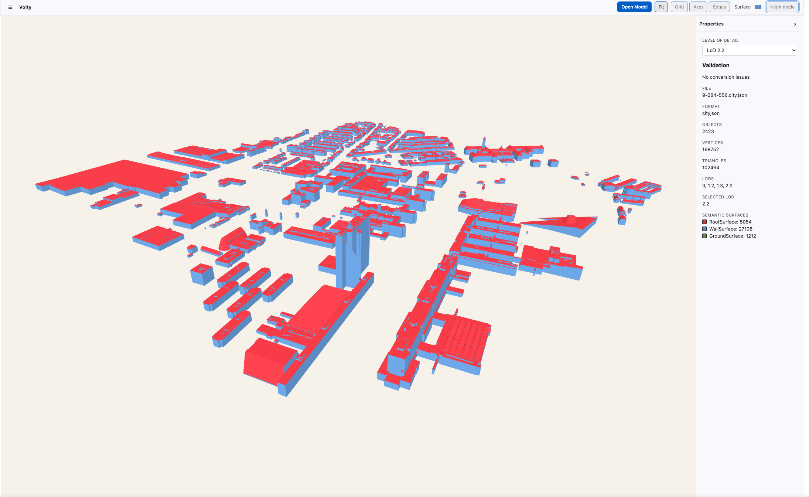
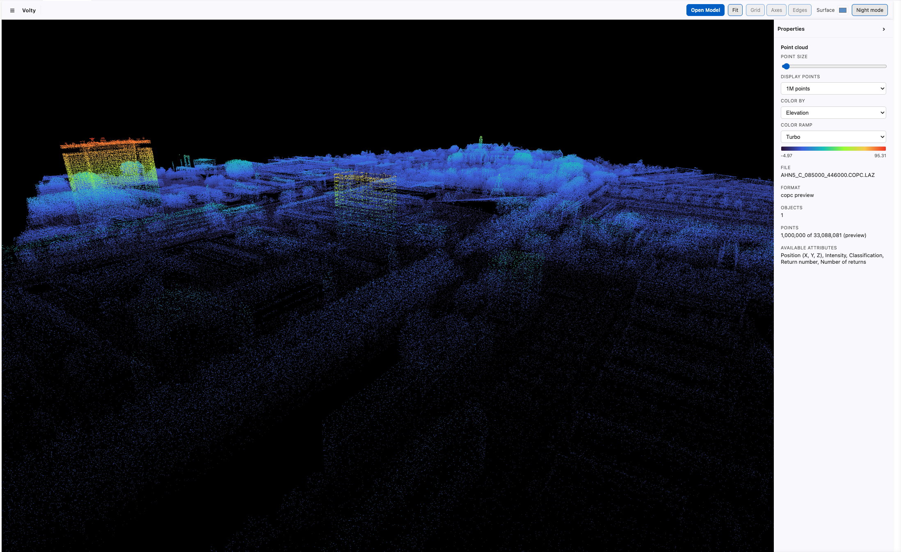
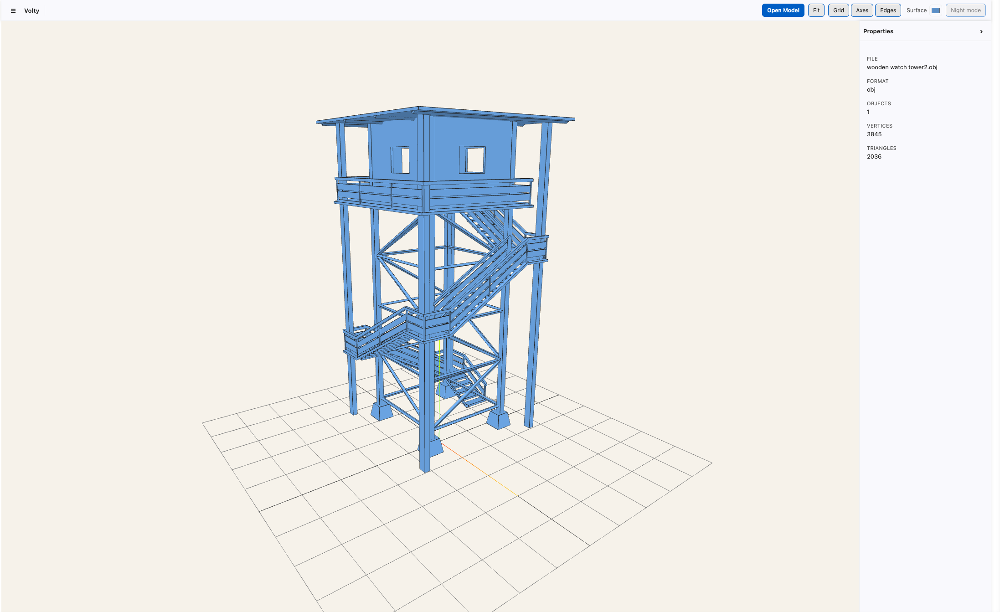

# Volty

<p align="center">
  
</p>

Volty is a lightweight 3D model and point-cloud viewer for Visual Studio Code.
It lets you inspect spatial data inside the editor instead of switching to a
separate desktop viewer.


## Screenshots

| [CityJSON](https://3dbag.nl/en/download?tid=9-284-556) |
| --- |
|  |


| [Point clouds](https://fsn1.your-objectstorage.com/hwh-ahn/AHN5_KM/01_LAZ/AHN5_C_085000_446000.COPC.LAZ)  |
| --- |
| |


| [Object files (eg. Wooden Tower)](https://free3d.com/3d-model/watch-tower-made-of-wood-94934.html) |
| --- |
|  |


## Supported formats

| Format | Support |
| --- | --- |
| CityJSON (`.json`) | Geometry, LoD switching, semantic surface colours, model details, and conversion warnings. |
| Wavefront OBJ (`.obj`) | Mesh geometry preview. |
| glTF (`.gltf`, `.glb`) | Mesh preview. |
| PLY (`.ply`) | Point-cloud preview, including available vertex colours.|
| LAS / LAZ / COPC LAZ (`.las`, `.laz`, `COPC.LAZ`) | Uniformly sampled preview with elevation, intensity, return, and classification colouring. |


## Features

- Open supported files from the Volty Activity Bar, Explorer, or Command Palette.
- Fit the camera to a model and orbit, pan, and zoom with standard Three.js controls.
- Toggle the grid, axes, edges, surface colour, and dark background.
- Collapse the toolbar and properties panel for a full renderer view.
- Inspect file format, object and triangle counts, CityJSON LoDs, semantic surface counts, and point-cloud metadata.
- Colour point clouds by elevation, RGB, intensity, return number, number of returns, or classification.
- Filter visible LAS/LAZ classifications directly from the properties panel.

## Install and run

### Development

**Windows**

```powershell
npm.cmd install
npm.cmd run compile
```

**macOS / Linux**

```bash
npm install
npm run compile
```

Press `F5` in VS Code to start an Extension Development Host. Select **Volty**
in the Activity Bar, then choose a supported file, or run **Volty: Open Model**
from the Command Palette.

### Install a VSIX

**Windows**

```powershell
npx vsce package
code --install-extension volty-1.0.0.vsix
```

**macOS / Linux**

```bash
npx vsce package
code --install-extension volty-1.0.0.vsix
```
> **Note**: If the code command is not available, open VS Code and run Shell Command: Install 'code' command in PATH from the Command Palette.

Restart VS Code after installation if Volty does not appear immediately.


## Project layout

```text
volty/
├── src/
│   ├── extension.ts       # VS Code commands, Activity Bar, and webview host
│   ├── model/              # File parsers and common model representation
│   ├── pointcloud/         # LAS/LAZ and COPC preview workers
│   └── webview/
│       └── main.ts         # Three.js renderer and viewer interaction
├── media/                  # Activity Bar icon and generated webview bundle
└── scripts/
    └── build-webview.cjs   # Webview bundle configuration
```

## Next steps

- Support to .ifc
- Object and surface selection.

## License

Volty is licensed under the MIT License. See [LICENSE](LICENSE) and
[THIRD_PARTY_NOTICES.md](THIRD_PARTY_NOTICES.md).
